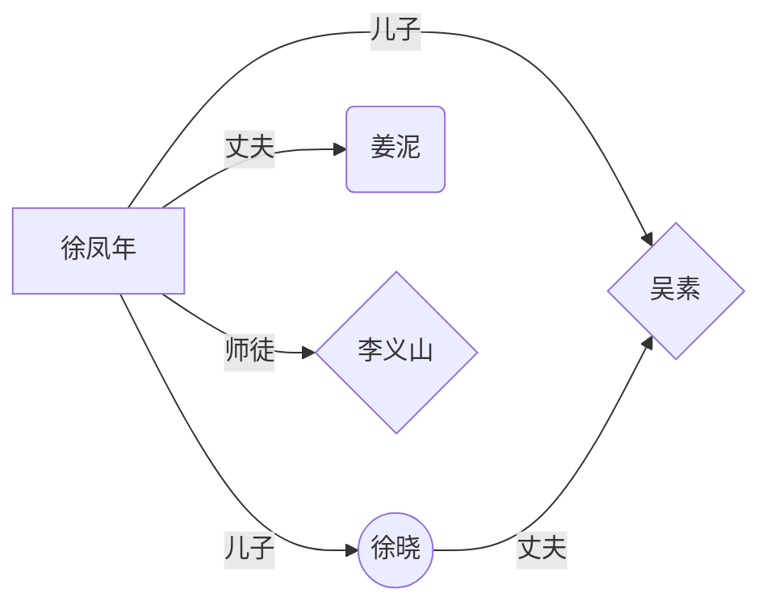

# 雪中悍刀行
## 1.简介
《雪中悍刀行》是烽火戏诸侯创作的长篇玄幻武侠小说，现在已经完结。该小说讲述一个关于**庙堂权争**与**刀剑交错**的时代，一个**暗潮涌动粉墨登场**的江湖。该作品荣获首届***网络文学双年奖***之银奖作品。是首届[泛华文网络文学金键盘奖](https://baike.baidu.com/item/%E6%B3%9B%E5%8D%8E%E6%96%87%E7%BD%91%E7%BB%9C%E6%96%87%E5%AD%A6%E9%87%91%E9%94%AE%E7%9B%98%E5%A5%96/62187031?fromtitle=%E6%B3%9B%E5%8D%8E%E6%96%87%E7%BD%91%E7%BB%9C%E6%96%87%E5%AD%A6%E2%80%9C%E9%87%91%E9%94%AE%E7%9B%98%E2%80%9D%E5%A5%96&fromid=60908231))

>泛华文网络文学金键盘奖由中国作协网络文学中心、江苏省委宣传部和江苏省作家协会指导，江苏省网络作协于2018年设立，该奖每两年评选一次，是国内首个面向全国，以[网络文学](https://baike.baidu.com/item/%E7%BD%91%E7%BB%9C%E6%96%87%E5%AD%A6/152347?fromModule=lemma_inlink)创作题材、IP改编形式进行细分的网络文学专业奖项。 

## 1.2 人物

- **徐凤年**：北凉王徐骁之子，故事的主角，表面上是个纨绔子弟，实际上智谋过人。
- **姜泥**：公主，徐凤年的爱人，随徐凤年上武当，游历天下。
- **徐晓**：徐凤年的父亲，北凉王，人称“人屠”，在战场上赫赫有名。
- **吴素**：徐凤年的母亲，已故。
			
## 1.3 关系表


## 1.4表格

|                |CS                          |瓦洛兰特                   |
|----------------|--------------------------------| ------------------------------
|豪腕|这不好玩吗？ | 这好玩吗？ |
|称呼|***妈 |“妈妈” |
|难点 |急停，育苗......|育苗|

## 1.5公式   
$$
CO + 2Fe = Coffee
$$

## 1.6代码
```python
#定义一个变量  
money = 50  
#通过print语句，记录输出内容  
print("钱包还有:",money)  
money = money - 10  
print("买了冰淇淋花费10r，现在钱包还剩：", money ,"元")
```

## 1.7代办
[x] 红线
[x] 次世代
[ ] 蝴蝶刀


